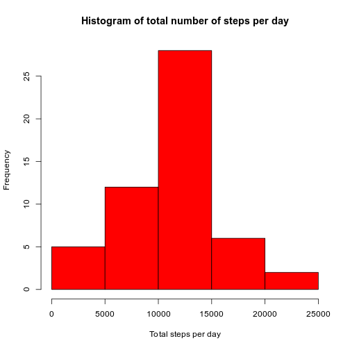
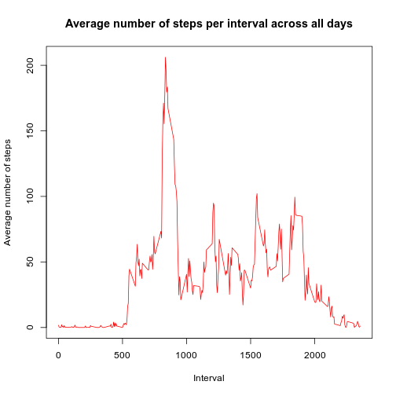
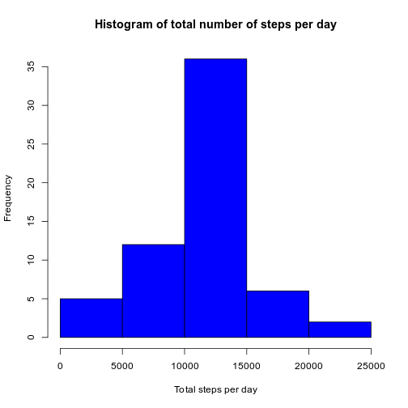
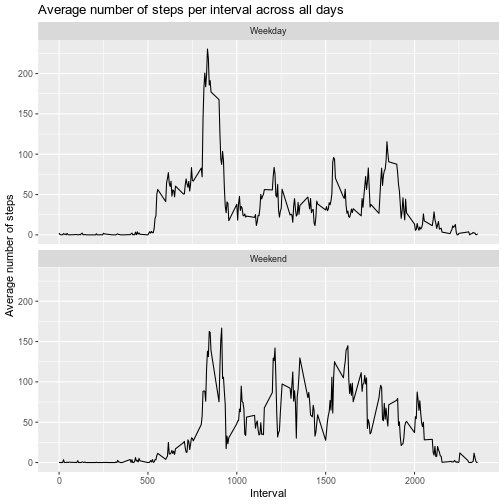

## Load and preprocess Data
1. Load necessary packages

```r
library(tidyverse)
```
2. Read "activity.csv" data and summary it

```r
data <- read.csv("activity.csv", header = TRUE, na.strings  = "NA")
str(data)
```

```
## 'data.frame':	17568 obs. of  3 variables:
##  $ steps   : int  NA NA NA NA NA NA NA NA NA NA ...
##  $ date    : Factor w/ 61 levels "2012-10-01","2012-10-02",..: 1 1 1 1 1 1 1 1 1 1 ...
##  $ interval: int  0 5 10 15 20 25 30 35 40 45 ...
```

```r
summary(data)
```

```
##      steps                date          interval     
##  Min.   :  0.00   2012-10-01:  288   Min.   :   0.0  
##  1st Qu.:  0.00   2012-10-02:  288   1st Qu.: 588.8  
##  Median :  0.00   2012-10-03:  288   Median :1177.5  
##  Mean   : 37.38   2012-10-04:  288   Mean   :1177.5  
##  3rd Qu.: 12.00   2012-10-05:  288   3rd Qu.:1766.2  
##  Max.   :806.00   2012-10-06:  288   Max.   :2355.0  
##  NA's   :2304     (Other)   :15840
```
3. Convert date column into Date type

```r
data <- data %>% mutate(date = as.Date(date))
```
## Mean total number of steps taken per day
1. Remove NA value


```r
sub_data <- data %>% filter(!is.na(steps))
```

2. Calculate the total number of steps taken per day


```r
steps.per.day <- sub_data %>% group_by(date) %>% summarise(total.steps = sum(steps, na.rm = TRUE))
```

3. Make a histogram of the total number of steps taken each day


```r
hist(steps.per.day$total.steps, main = "Histogram of total number of steps per day", xlab = "Total steps per day", col="red")
```



4. Calculate and report the mean and median of the total number of steps taken per day


```r
# mean
mean(steps.per.day$total.steps)
```

```
## [1] 10766.19
```


```r
# median
median(steps.per.day$total.steps)
```

```
## [1] 10765
```

## Average daily activity pattern

1. Make a time series plot (i.e. type="l") of the 5-minute interval (x-axis) and the average number of steps taken, averaged across all days (y-axis)

```r
# Calculate mean for each interval for all day
steps.per.interval <- sub_data %>% group_by(interval) %>% summarise(mean.steps = mean(steps, na.rm = TRUE))

# create a time series plot of the 5-minute interval (x-axis) and the average number of steps taken, averaged across all days
plot(steps.per.interval$interval, steps.per.interval$mean.steps, type='l', 
     main="Average number of steps per interval across all days", xlab="Interval", 
     ylab="Average number of steps", col="red")
```



2. Find the 5-minute interval which contains the maximum number of steps on average across all the days in the dataset


```r
interval <- steps.per.interval$interval[which.max(steps.per.interval$mean.steps)]
interval
```

```
## [1] 835
```

## Imputing missing values

1. Calculate and report the total number of missing values in the dataset (i.e. the total number of rows with NAs)


```r
total.NA <- sum(is.na(data$steps))
total.NA
```

```
## [1] 2304
```

2. Create a new dataset that is equal to the original dataset but with the missing data filled in
   
   Filling in all of the missing values in the dataset with the mean of its 5-minute interval


```r
new.data <- data
for (i in steps.per.interval$interval) {
    new.data[new.data$interval == i & is.na(new.data$steps), ]$steps <- 
        steps.per.interval$mean.steps[steps.per.interval$interval == i]
}
head(new.data)
```

```
##       steps       date interval
## 1 1.7169811 2012-10-01        0
## 2 0.3396226 2012-10-01        5
## 3 0.1320755 2012-10-01       10
## 4 0.1509434 2012-10-01       15
## 5 0.0754717 2012-10-01       20
## 6 2.0943396 2012-10-01       25
```

3. Make a histogram of the total number of steps taken each day for the new dataset
    

```r
steps.per.day.new <- new.data %>% group_by(date) %>% summarise(total.steps = sum(steps, na.rm = TRUE))
hist(steps.per.day.new$total.steps, main = "Histogram of total number of steps per day", xlab = "Total steps per day", col="blue")
```



4. Calculate and report the mean and median total number of steps taken per day


```r
# mean
mean(steps.per.day.new$total.steps)
```

```
## [1] 10766.19
```


```r
# median
median(steps.per.day.new$total.steps)
```

```
## [1] 10766.19
```
    We can see that the mean and median for the new dataset with the filled-in missing values are the same
    
## Differences in activity patterns between weekdays and weekends

1. Create a new factor variable in the dataset with two levels – “weekday” and “weekend” indicating whether a given date is a weekday or weekend day.

Create function check a day is weekday or weekend

```r
#load libarary lubridate
library(lubridate)
isWeekend <- function(day){
    d <- wday(day)
    if  (d == 1 || d == 7){
        'Weekend'
    } else {
        'Weekday'
    }
}
```

Create a new factor variable in the dataset with two levels – “weekday” and “weekend”

```r
new.data$day.type <- as.factor(sapply(new.data$date, isWeekend))
```

2. Make a panel plot containing a time series plot (i.e. type = “l”) of the 5-minute interval (x-axis) and the average number of steps taken, averaged across all weekday days or weekend days (y-axis).


```r
# calculate average steps by interval across all days
steps.per.interval.new <- new.data %>% group_by(interval, day.type) %>% summarise(mean.steps = mean(steps, na.rm = TRUE))

# creat a plot
qplot(interval, 
      mean.steps, 
      data = steps.per.interval.new, 
      geom=c("line"),
      xlab = "Interval", 
      ylab = "Average number of steps", 
      main = "Average number of steps per interval across all days") + facet_wrap(. ~ day.type, ncol = 1)
```


